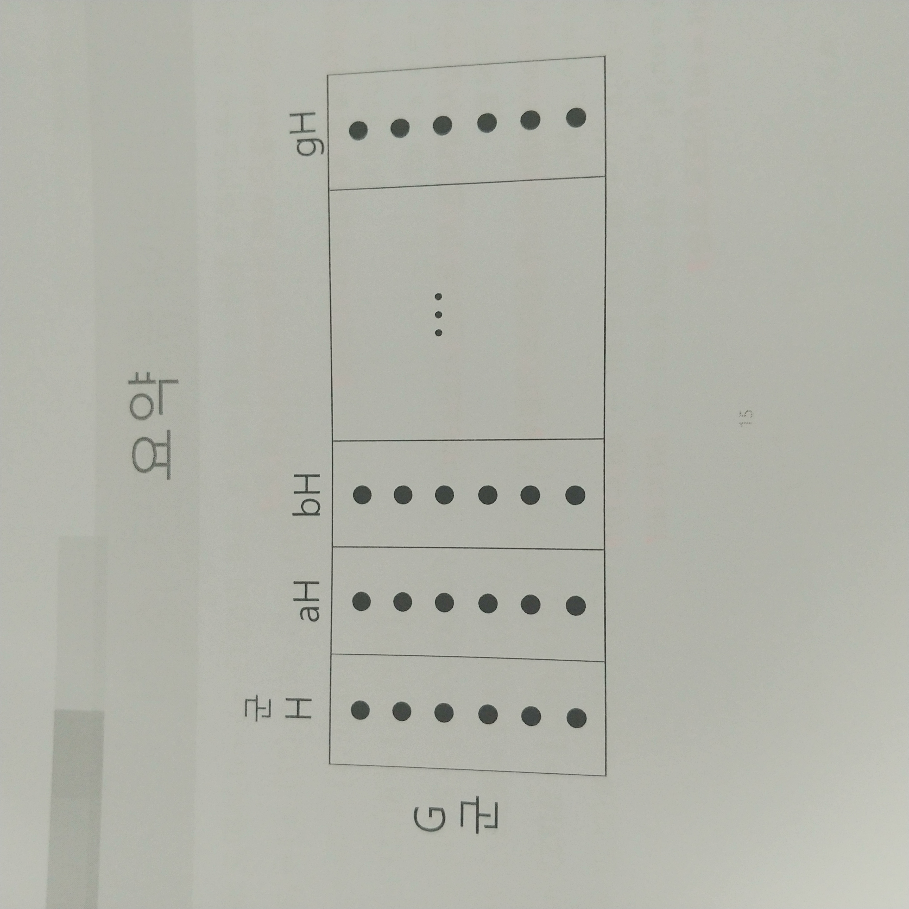
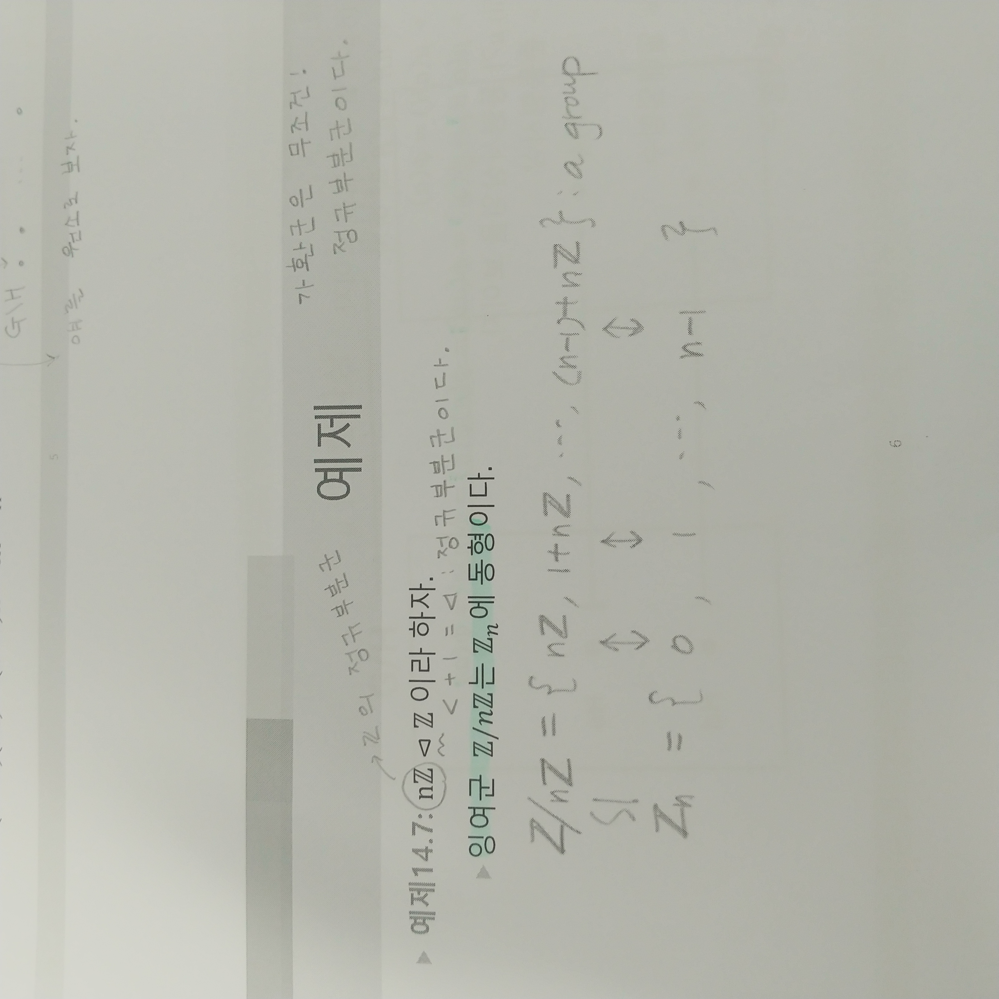
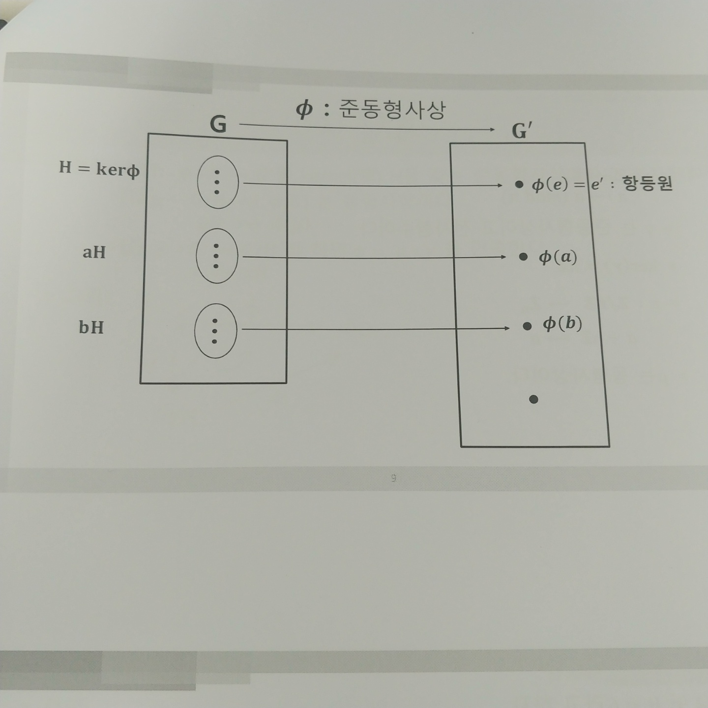
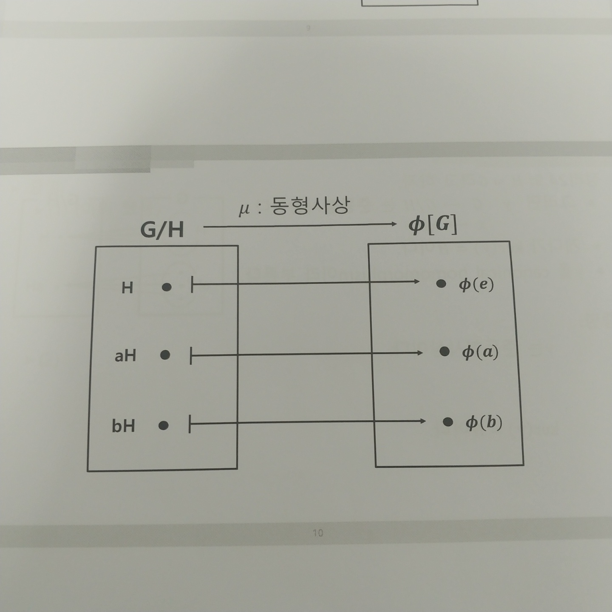

## 버튼 누르고 관련개념 보기
```c

*****css에*****

.popup_btn a {
    display: inline-block;
    padding: 20px;
    background: darkred;
    color: #fff;
    border-radius: 5px 0 10px 0;
  }
  
  .overlay {
    position: fixed;
    top: 0;
    bottom: 0;
    left: 0;
    right: 0;
    background: rgba(0, 0, 0, 0.7);
    transition: opacity 500ms;
    visibility: hidden;
    opacity: 0;
    z-index: 900;
  }
  
  .overlay:target {
    visibility: visible;
    opacity: 1;
  }
  
  .popup {
    position: fixed;
    width: 60%;
    padding: 30px;
    max-width: 1100px;
    border-radius: 10px;
    top: 50%;
    left: 50%;
    transform: translate(-50%, -50%);
    background: white;
    /* "delay" the visibility transition */
    -webkit-transition: opacity .5s, visibility 0s linear .5s;
    transition: opacity .5s, visibility 0s linear .5s;
    z-index: 1;
  }
  
  .popup:target {
    visibility: visible;
    opacity: 1;
    /* cancel visibility transition delay */
    -webkit-transition-delay: 0s;
    transition-delay: 0s;
  }
  
  .popup-close {
    position: absolute;
    padding: 10px;
    max-width: 500px;
    border-radius: 10px;
    top: 50%;
    left: 50%;
    transform: translate(-50%, -50%);
    background: rgba(255, 255, 255, .9);
  }
  
  .popup .close {
    position: absolute;
    right: 5px;
    top: 5px;
    padding: 5px;
    color: #000;
    transition: color .3s;
    font-size: 2em;
    line-height: .6em;
    font-weight: bold;
  }
  
  .popup .close:hover {
    color: red;
  }

  img:hover {
    transform: scale(1.5);}
    
-------------------------------------------------------------------------    

*****html에*****

<div class="flex-box">
    <div class="popup_btn flex-item text1">
      <a href="#pop01">factor or quotient</a>
    </div>


    <div id="pop01" class="overlay">
      <div class="popup">
        <a href="#none" class="close">&times;</a>
        
        
        
        

      </div>
    </div>
```
### 버튼 누르면 사진으로 되어있는 을 볼 수 있음. css의 <popout .close> 는 창닫기표시 관련 내용

## 임용기출에서도 위 기능을 이용 문제를 제시, 버튼을 클릭하면 솔루션을 볼 수 있게 하였음

## 문제 풀기
```c
<h3> 체 X 체 = 체? (y/n)</h3>
    <form id="sign-up1">
      <label for="user-ide">정답입력</label>
      <br>
      <input type="text" name="userIde" id="user-ide"><br>


      <input type="submit" value="정답확인">
    </form>
  
--------------------------------------------------------------
 
  <script>
    const form = document.querySelector('#sign-up1');
    form.onsubmit = function () {
      const userIde = document.querySelector('#user-ide').value;


      if (userIde == 'y') {
        alert('정답입니다.');
        return false;
      } else {
        alert('(체 X 체) 는 체가 아닙니다. 왜냐하면 (0,1) X (1,0) = (0,0) 이기 때문에 정역부터 안 되기 때문이죠.');
      }
    };
  </script>
```
### 정답인  을 입력하고 확인버튼을 누르면 <정답입니다.> 가 뜨고, 그 외 다른것을 입력하거나 그냥 정답확인 버튼을 누르면 <(체 X 체) 는 체가 아닙니다. 왜냐하면 (0,1) X (1,0) = (0,0) 이기 때문에 정역부터 안 되기 때문이죠.> 가 뜸

## 키프레임
```c
.key{
  width: 1600px;
  height: 300px;
  margin-left: 500px;
  background-color: rgba(0, 0, 0, 0.3);
  background-position: center center;
  background-size: cover;
  background-blend-mode: overlay;
  position: relative;
  overflow: hidden;
  font-size: 5rem;
}

.key > * {
  position: absolute;
}

.key > h1 {
  top: 80px;
  left: 50px;
  color: white;
  animation-name: banner-title;
  animation-duration: 2s;
  animation-timing-function: ease-out;
}


@keyframes banner-title {
  from { left: -50%; }
  to { left: 50px; }
}

```

## 한 학기 수업 후 느낀점
```c
사범대생으로 컴퓨터와 관련된 강의를 이번에 처음 들어보았습니다.
사실 뒤에 자바스크립트 부분부터는 잘 따라가지 못했지만 전반적으로 재미있게 들었습니다.
특히나 자바스크립트 이전 부분까지는 저 같은 학생도 따라하기 매우 쉽고 재미도 있어서 과제가 아니더라도 평소에 이것저것 해보면서 친구들에게 편지를 만들어 보냈는데 다들 좋아했습니다. 
또한 자바스크립트 부분부터는 잘 수행하지 못한 것이 아쉬워 방학 때 좀 더 공부를 해보고 싶습니다.
최종적으로는 이번 학기에 배운 내용을 이용해 수업 자료를 만드는 것이 목표입니다. 
한 학기동안 좋은 수업 감사합니다:)
```
